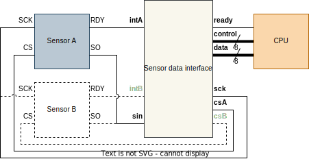
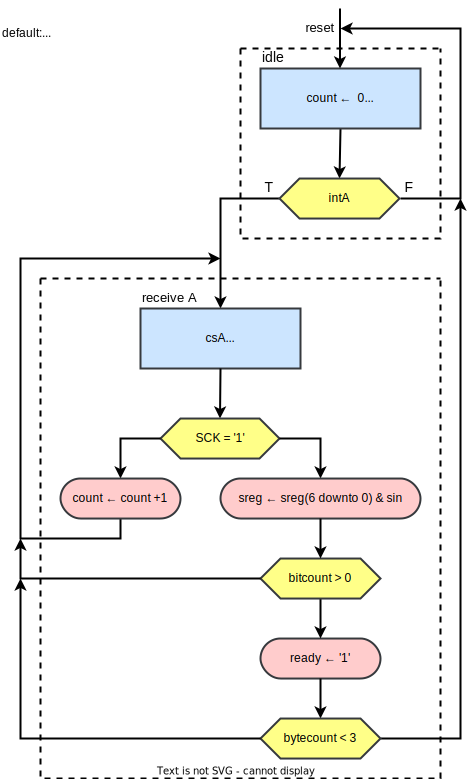

# Sensor data interface

|  |
| :---: | 
| System Overview |

## Specification
We have a system with one sensor that communicate serially

The sensor has 
* A chip select (CS) signal, telling when it is allowed to send data 
* A serial clock (SCK) that is used when transmitting data
  * next bit are put on the bus (sin) when SCK goes low
* A ready flag (RDY) tells when there is new sensor data
  * = interrupt signal
    
Data shall be transmitted to the CPU in parallell 
* one databyte at a time + control byte 
  * control describe which data is being sent
* The CPU reads both control and data when ready is flagged
  * Sending data takes exactly 1 clock cycle
* The CPU is synchronized with the interface - uses the same system clock (clk).

Sensor A has 3 data bytes each time ready is flagged. 
* Control data will be divided into two nibbles of four bits
  * The most significant nibble tells which sensor, where A is designated 4d"1"
  * The least significant nibble tells which byte number is sent, starting at 4d"0" 

## Derived ASMD diagram
|  |
| :---: | 
| ASM diagram |
